<h1 align="center">Elijah James Designs</h1>

### **Live Site**
[Elijah James Designs Live Site](https://elijah-james-designs.herokuapp.com/)

### **Repository:**
[Elijah James Designs Repository](https://github.com/JamesFahey/project5_elijah_james_designs)

# Intro
This is a full-stack e-commerce project built using Django, Python, HTML, CSS, and JavaScript. I have created this website for Elijah James Designs. This website is for a Business to Consumer (B2C) business that sells art designed and created by children. The target market for these products will be families, young children and people looking for gift ideas.

# Table of Contents

[User Experience](#user-experience)

- [Strategy](#strategy)

- [User Stories](#user-stories)

- [Scope](#scope)

- [Structure](#structure)
    - [Databases](#databases)
    - [Wireframes](#wireframes)

[Marketing Strategies](#marketing-strategies)

[Features](#features)

[Features to be Implemented](#features-to-be-implemented)

[Technologies Used](#technologies-used)

[Testing](#testing)

[Validator Testing](#validator-testing)

[Responsive Testing](#responsive-testing)

[Bugs Found](#bugs-found)

[User Feedback](#user-feedback)

[Search Engine Optimisation (SEO)](#search-engine-optimisation-seo)

[Deployment](#deployment)

[Credit](#credit)

[Acknowledgments](#Acknowledgments)

# Goals

The goal of the project is to create a fully functioning and responsive website for the new company Elijah James Designs. The website will allow users browse all products by using the easily accessible navigation and sorting features. The site will also have a search function allowing for a more specific search. Users may also register with the site which will store their information for an easier checkout experience while storing their order history.

All users will also have the option to leave a review on items they have purchased or interested in purchasing. Users may also subscribe to a monthly newsletter from the site keeping users up to date with new products and upcoming promotions. There will also be an option for users to contact the owner directly to ask any questions or make requests. Users will receive a response via email as soon as possible, they will also receive a confirmation email after completing an order and registering with the site.
The site is designed to grow with the business itself. Overtime more and more products will be added along with new features and upgrades to existing ones

# User Experience

## UX

User experience has been designed with a minimalistic, clean, and professional look. A white background and contrasting black for text banners and buttons allow for the pieces of art to catch the attention of the user as it would be if they were hanging in an actual art gallery.

While browsing the site customers can read descriptions of all products on offer and any reviews left by other users. There will also be a section for users to learn more about the artists and contact them for any personal requests. Users can follow links to the business’ facebook page as well as signing up to receive the monthly newsletter for latest offers and promotions.

Payments will be quick and simple using the built in stripe system allowing payments via credit or debit card.

# User Stories

Please find my Kanban Board with my user stories [here](https://github.com/JamesFahey/project5_elijah_james_designs/projects/1). Below is a detailed list of User Stories per User Type.

## Superuser / Admin
1.	As a Site Owner I want to be able to add a product so that I can grow the number of options for users to purchase.
2.	As a Site Owner I want to be able to Edit/Update a product so that I can change any product options such as price, descriptions etc.
3.	As a Site Owner I want to be able to delete a product so that I can remove items that are no longer available.
4.	As a Site Owner I want to be able to provide to customers with a subscription, notifying them of any deals, new items or upcoming promotions.
5.	As a Site Owner, I want to be able to remove reviews from the site in case anything inappropriate was left.

## Shopper
1.	As a Shopper I want to be able to view a range of products so that I can add them to my basket.
2.	As a shopper I want to be able to click onto a product so that I can view a product description before adding it to my basket.
3.	As a shopper I want my basket to keep a total of all my purchases so that I can keep track of what I am spending.
4.	As a shopper I want to be able to adjust the number of products in my basket so that I can add multiple of the same item or remove some if necessary.
5.	As a shopper I want to be able to pay online using debit or credit card so that I can check out quickly and easily.
6.	As a shopper I want to be able to feel that the payment information I am providing are safe and secure so that I can complete my purchase without the risk of fraud.
7.	As a shopper I want to be able to receive an order confirmation so that I can ensure there has been no errors with my order.
8.	As a shopper I want to be able to order without having to create an account so that I can make quick and easy purchases.
9.	As a shopper I want to be able to sort products by category so that I can find a range of products I’m interested in.
10.	As a shopper I want to be able to filter my products so that I can find the best-priced product or the highest rated for examples.
11.	As a shopper I want to be able to use a search bar to find a specific item so that I can quickly see whether the product is available.
12.	As a shopper I want to be able to register for customer account so that I can store personal info and keep track of past orders.
13.	As a shopper I want to be able to have the option to recover my password so that I can still access the account if I forget my login information.
14.	As a shopper I want to be able to receive an email confirmation once my account has been set up so that I can confirm registration.
15.	As a shopper I want to be able to sign up for a monthly newsletter so that I can keep up to date with new releases and upcoming promotions and deals.
16.	As a shopper, I want to be able to contact the business owner so that I can ask any questions regarding products for sale, current orders, or specific requests.
17.	As a shopper, I want to be able to leave a review for a previously purchased item on the site so I can give my feedback to the business owner and other potential buyers.

After creating my user stories, I assigned each a tag with varying levels of importance. These ranged from the most important tag ‘Must have’, ‘Should have’ for the features which should be included and the least important tagged ‘could have’. 

Once all user stories had been finalised, I created Github Project in a Kanban format. Using these project boards allowed for greater ease in organising and prioritising my work. My project board was comprised of columns labelled; To do, In progress, Done and Future content. All user stories, known as issues in the project, began in the ‘To do’ column and progressed them throughout the project.

# Databases

For the live site, I connected Heroku's Postgres Database and while working in my local environment I continued to use the Sequel Light. The Entity-Relationship Diagram below shows how the database models connect in order to produce the finished sites functionality.

## Category

The Category model is used to create categories for products to be assigned to. This model will be the primary source for filtering a searching through products, whether that be product type or deals etc

## Products

The Product model will be used to add items to the site for sale. Through this model the site owner or admin user will be able to add, update or delete a chosen product. It will also display all products on the site including a product details page.

## Order & Order Line Items

The Order model will process an order made by the customer, this connects with the  Order Line Items model to complete the customers purchase.

## User Profile

The User Profile model allows customers to store delivery information allowing for an easier checkout process.

## Review

The Review model allows any user to submit a review on a purchase they have made, whether they or registered or not. As all users can make a purchase all users can also leave a review. Users can access this function through the product details page

# Wireframes

All wireframes were created using [Balsamiq](https://balsamiq.com/).

Elijah James Designs Wireframes can be viewed here:

   [Desktop](assets/readme-imgs/wireframes/desktop/)

   [Mobile](assets/readme-imgs/wireframes/mobile/)

#Marketing Strategies

The following questions were asked and answered when trying to decide on the best marketing strategy.

1.	Which online platforms would you find lots of your users?

- Facebook
- Instagram
- Tiktok
- Etsy
- Pinterest

2.	Would your users use social media? If yes, which platforms do you think you would find them on?

- Facebook
- Instagram
- Tiktok

3.	What do your users need? Could you meet that need with useful content? If yes, how could you best deliver that content to them?

- Instagram and facebook Posts of gift ideas and product combinations:
- Tiktok videos showing highlights of the pieces of art being made
- Emails to users around monthly occasions such mothers or fathers day

4.	Would your business run sales or offer discounts? How do you think your users would most like to hear about these offers?

- Run sales promotions during key holidays to increase customer base. These promotions can be distributed via email or newsletter subscriptions. Pop up adds

5.	What are the goals of your business? Which marketing strategies would offer the best ways to meet those goals?

- Increase customer base and sales as a result
- Gather repeat customers through high quality products
- Increase brand awareness

6.	Would your business have a budget to spend on advertising? Or would it need to work with free or low-cost options to market itself?

- The business would rely on free or low cost marketing initially with very little spare budget. The primary source of marketing would be through word of mouth after purchasing high quality items and other good customer satisfaction 

## Facebook

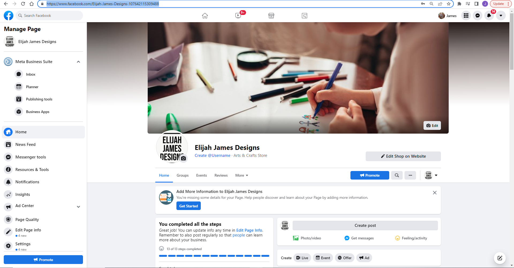

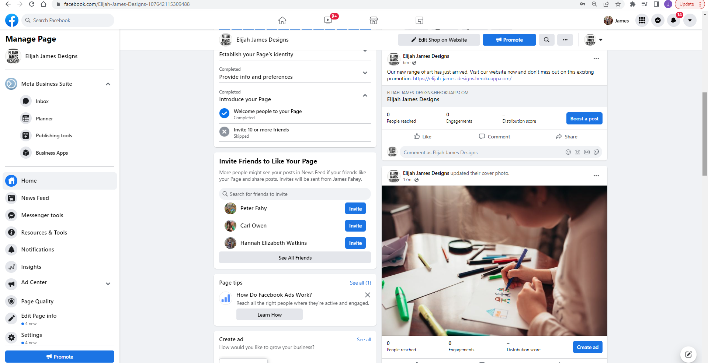

## Subscription

Users also have the opportunity to sign up the Elijah James Designs' newsletter which will keep them up to date will also promotions and deals. This can be found within the footer of the site

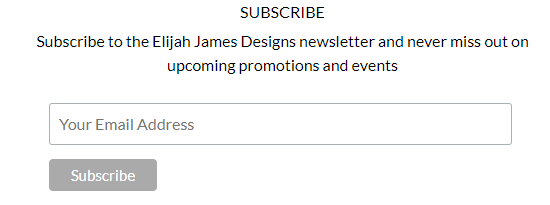

# Features

## Homepage

### Logo / Shop Name

### Search Bar 

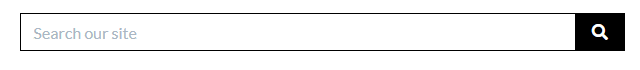

### My Account 

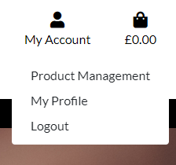

### Shopping Bag 

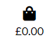

### Bootstrap Toast

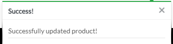

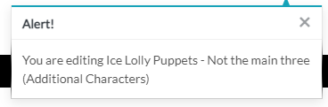

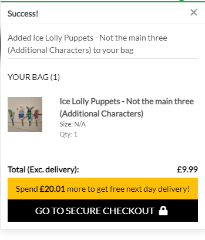

### Product Navigation

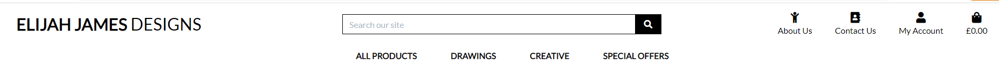

### Delivery Banner

### Other Links

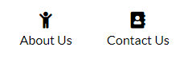

### Welcome Message

## My Account

### Account Registration

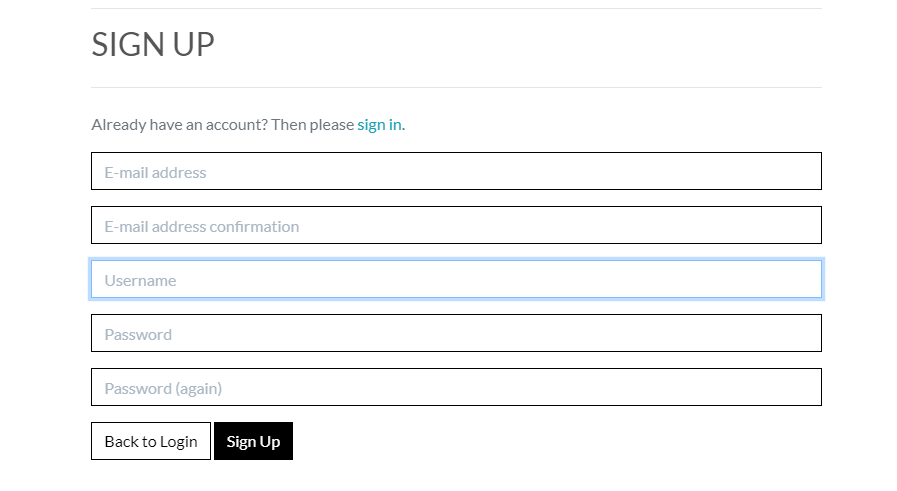

### Sign In

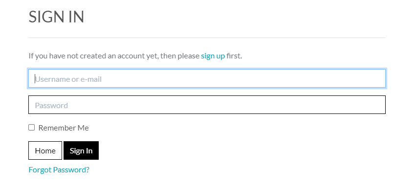

### My Profile

- Delivery Information

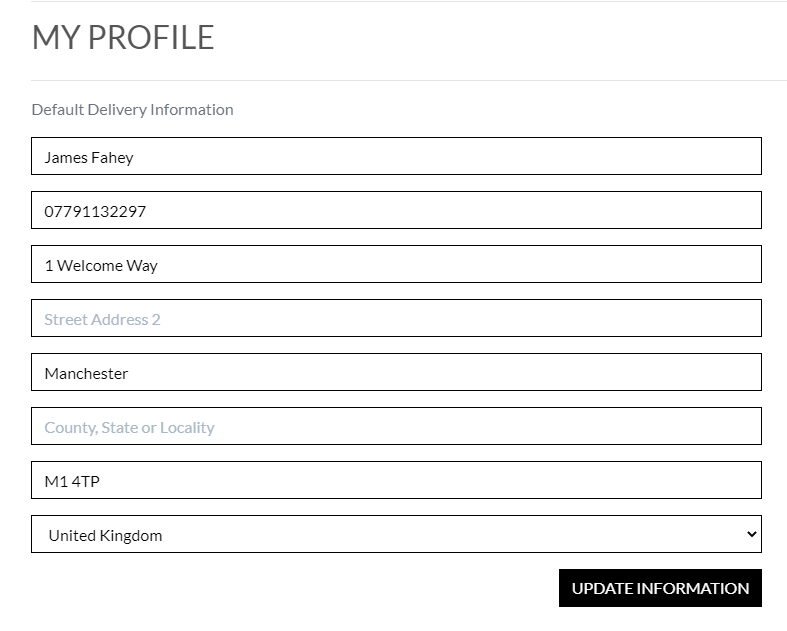

- Order History

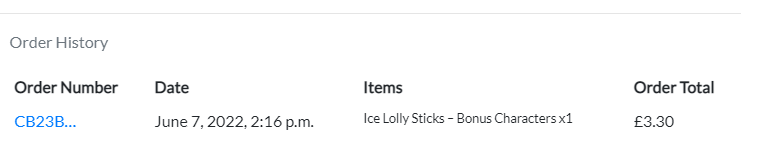

- Order Confirmation

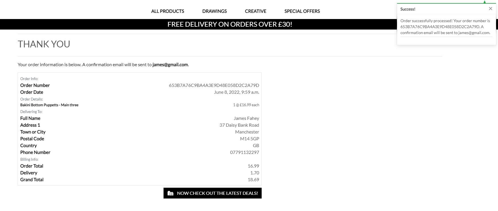

### Sign Out

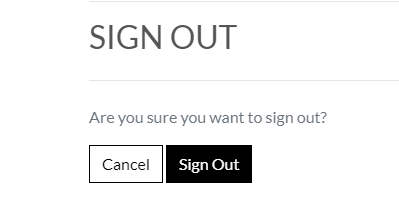

## Products Page 

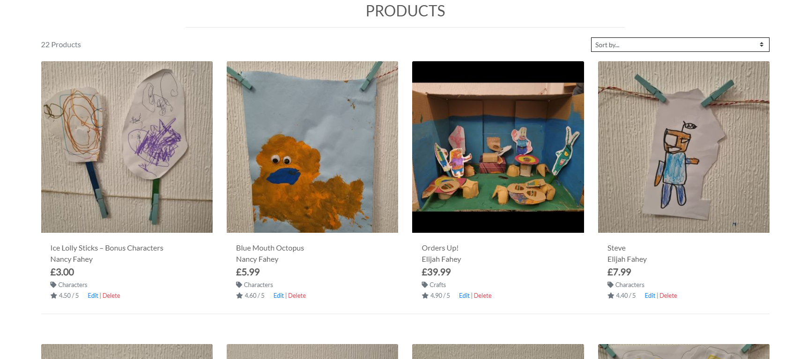

## Product Details 

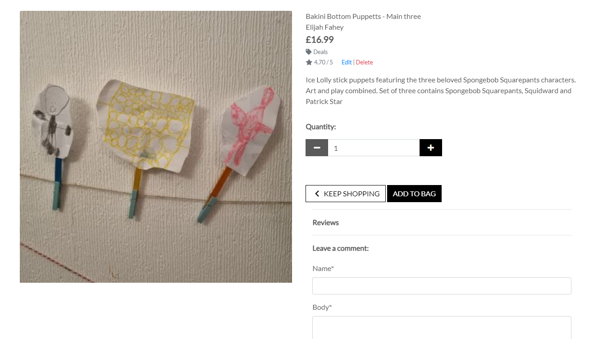

## Product Review

Visable on the bottom of the Product Details Page

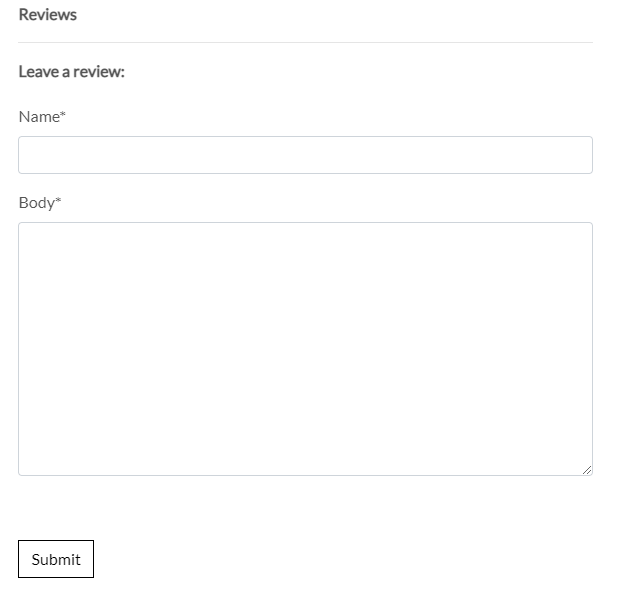

## Shopping Bag

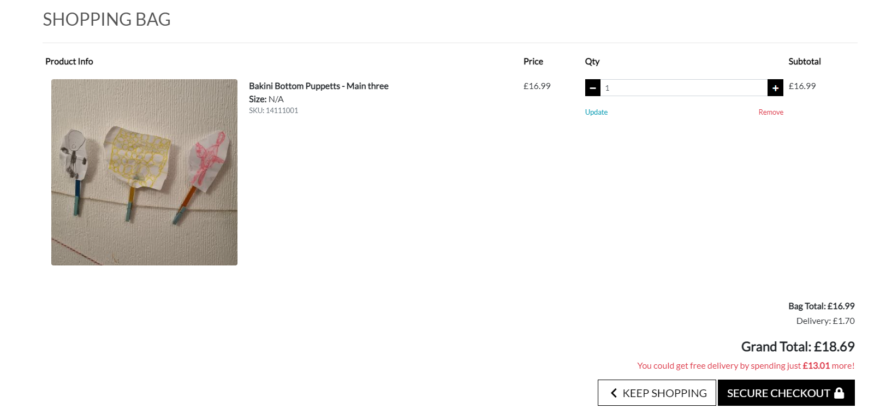

## Checkout

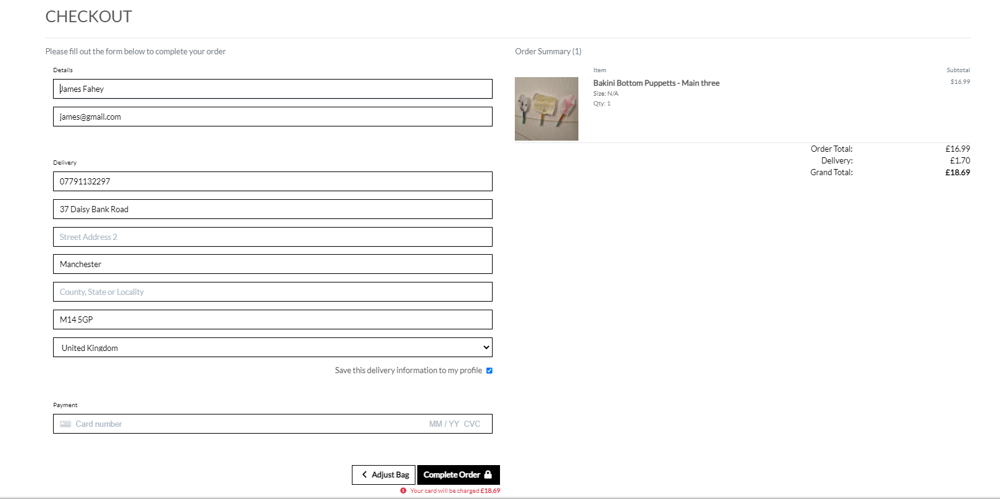

## Footer

### About Us

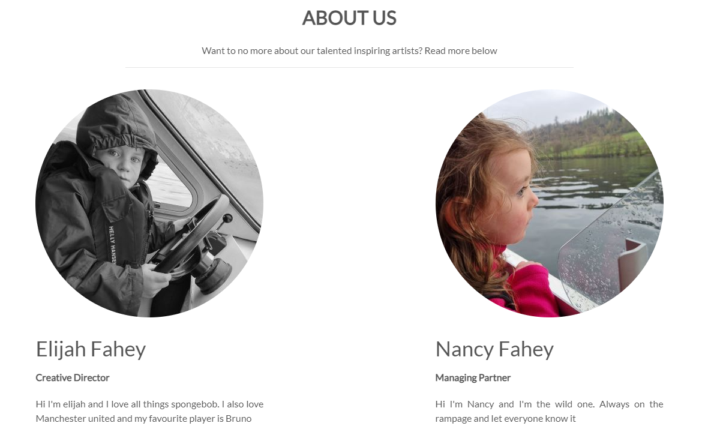

## Contact Form

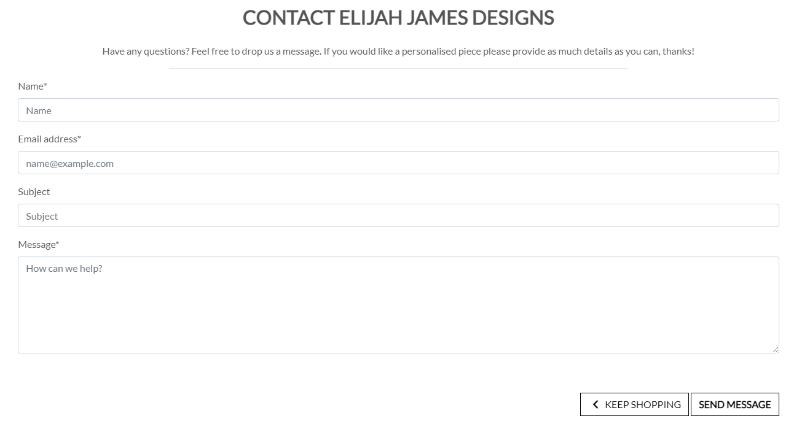

## 404 Error Page

## Admin Features

### Product Management

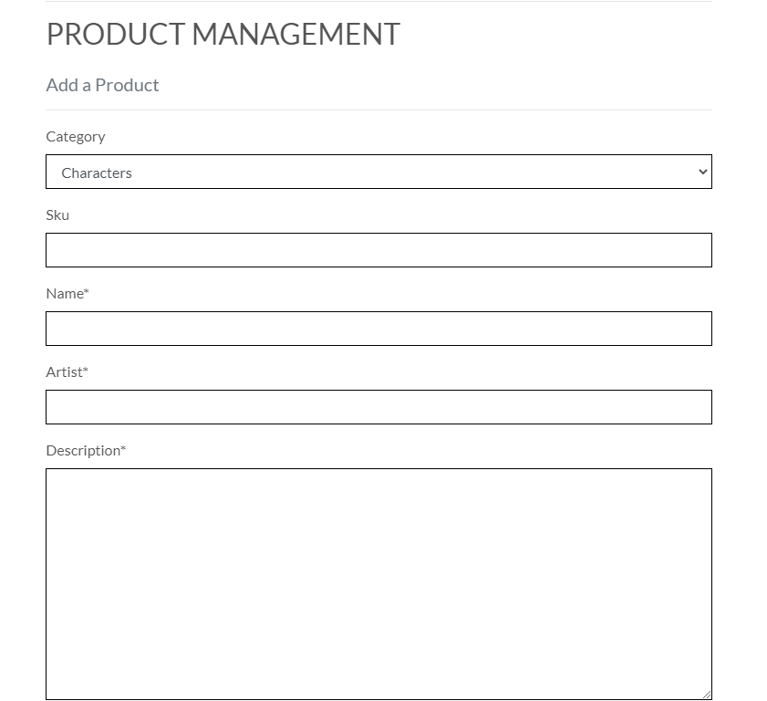

### Edit Products

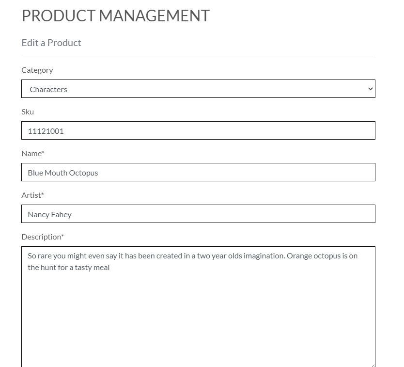

## Features to be Implemented

- A featured section will be added to the home page
- A community section showcasing various art events in the area.
- Add a favourite section for users to come back to a certain product in the future

# Technologies Used

### Coding Languages

- [HTML](https://en.wikipedia.org/wiki/HTML)
- [CSS](https://en.wikipedia.org/wiki/CSS)
- [Python](https://www.python.org/)
- [JavaScript](https://www.javascript.com/)

### Libraries, Frameworks & Tools

- [Django](https://www.djangoproject.com/) - Framework used to build the site and admin page.
- HerokuSQL - Database used in the project.
- Python OS. - Used for os.environ to help with automated development DEBUG
- Markdown. - Used for creating README.md document.
- [Bootstrap](https://getbootstrap.com/) - Used for styling the site a framework addition to CSS3.
- [Stripe](https://www.stripe.com/) - Handling Payments
- jQuery - Minimising Code
- [Font Awesome](https://fontawesome.com/) - Used for icons and their animations
- Django Allauth - Used to handle user authentication

### Hosting Technologies

- [Heroku](https://www.heroku.com/) - Deployment and hosting environment.
- [AWS](https://aws.amazon.com/). - Storing images and static files.
- [GitHub](https://github.com/) - Hosting Repository code

# Validator Testing

- The HTML templates were validated using W3 Validator. No major errors were returned for the HTML segments.
- The CSS style sheet was validated using W3C Validator and no errors were returned.
- The JavaScript files were run through JSHint and no errors were found 
- The python code was validated using PEP8. No errors were returned.

# Responsive Testing

The sites responsiveness has been tested on a number of platforms and smaller devise including:

- iPhone X
- iPhone 6
- Samsung S21 
- Samsung S20
- iPad Pro 9.7"
- Samsung S10

I also used Google developer tools to check responsiveness across multiple other devices and screen sizes.

# Manual Testing by User Story

## Superuser / Admin

1. 	As a Site Owner I want to be able to add a product so that I can grow the number of options for users to purchase.

- Products can either be added via the admin section or by the project management section accessible for the superuser only. Both methods have successfully added new products. 

2. 	As a Site Owner I want to be able to Edit/Update a product so that I can change any product options such as price, descriptions etc..

- While logged in as a superuser the option to edit a product is available by the all products page and the product detail page.

3. 	As a Site Owner I want to be able to delete a product so that I can remove items that are no longer available.

- While logged in as a superuser the option to delete a product is available by the all products page and the product detail page.

4.	As a Site Owner I want to be able to provide to customers with a subscription, notifying them of any deals, new items or upcoming promotions.

- Users can subscribe to our newsletter via the mailchimp subscription form in the footer of the site.

5. 	As a Site Owner, I want to be able to remove reviews from the site in case anything inappropriate was left.

-  The superuser has the option to remove any inappropriate reviews via the admin panel

## Shopper

1. 	As a Shopper I want to be able to view a range of products so that I can add them to my basket.

- All products are displayed neatly using bootstrap cards remaining responsive across all screen sizes

2. 	As a shopper, I want to be able to click into an item so that I can view a product description and add to the basket.

- From the main product page users have the option to click into a product to see further details more clearly including product description

3. 	As a shopper I want my basket to keep a total of all my purchases so that I can keep track of what I am spending.

- When adding items to the shopping back users will see their shopping total underneath the shopping bag icon in the top right of the screen.

4. 	As a shopper I want to be able to adjust the number of products in my basket so that I can add multiple of the same item or remove some if necessary.

- While the customer is in the shopping bag section they can increase and descrease the number of items in their bag. They also have the option to remove the item entirely. The shopping bag total will be adjusted with each change

5. 	As a shopper I want to be able to pay online using debit or credit card so that I can check out quickly and easily.

- Shoppers are able to complete their transaction quick and easily using the sites built in stripe functionality

6.	As a shopper I want to be able to feel that the payment information I am providing are safe and secure so that I can complete my purchase without the risk of fraud.

- Only customer delivery information will be stored for the checkout section and all payments are handled securely via stripe

7. 	As a shopper I want to be able to receive an order confirmation so that I can ensure there has been no errors with my order.

- After completing an order customers will receive a success message top right of the screen while being taken to an order confirmation page with the following info:
- - Order Number
- - Order Date
- - Product Name and Quantity
- - Price per item
- - Delivering to
- - Phone Number
- - Address
- - Order Total
- - Delivery Cost
- - Grand Total

8.	As a shopper I want to be able to order without having to create an account so that I can make quick and easy purchases.

- Any user can complete a purchase without creating an account but wont be able to store delivery information

9.	As a shopper I want to be able to sort products by category so that I can find a range of products I’m interested in

- The main navigation of the site allows for sorting of products via categories

10.	As a shopper I want to be able to filter my products so that I can find the best-priced product or the highest rated for examples.

- Users will have the option to filter by several options including price, rating and alethically.

11.	As a shopper I want to be able to use a search bar to find a specific item so that I can quickly see whether the product is available.

- The site will offer a search function allowing users to search for a more specific item. 

12.	As a shopper I want to be able to register for a customer account so that I can store personal info and keep track of past orders.

- Users have the option to register for account. Doing this allows them to store delivery information and also view past orders

13.	As a shopper I want to be able to have the option to recover my password so that I can still access the account if I forget my login information.

- In the login page users can click forgot password to start the process of resetting their password

14.	As a shopper I want to be able to receive an email confirmation once my account has been set up so that I can confirm registration.

- Once the user has completed the sign up form they will receive a verification email requesting the user to follow the link to complete registration 

15.	As a shopper I want to be able to sign up for a monthly newsletter so that I can keep up to date with new releases and upcoming promotions and deals.

- The user has the option to sign up to a monthly newsletter in the footer of the site. This is provided by Mailchimp

16. As a shopper, I want to be able to be able to contact the site owner so that I can ask about my order or for further information not contained within the Footer Pages.

- Within the contact us section users will have the option to complete a form to speak directly to the site owner. Here they can ask about orders made or request a specific piece. 

17.	As a shopper, I want to be able to be able to leave a review for a previously purchased item on the site so I can give my feedback to the business owner and other potential buyers.

- On the products details page there is a section for all users to leave a review on a product. The small form contains the review body, name of the reviewer and date and time

# Bugs Found

I encountered the following issues whilst building this project:

- On the deployed Heroku site any time the email system was called upon, whether that was signing up to an account or completing the contact form, the user received a server 500 error. I initially worked around this by adding a development variable to Heroku convig vars. Then for submission I removed the DEVELOPMENT tag from my settings and set debug to false as in other projects.

- The images from the about us section were not showing on the live site. To fix this I used the image url from AWS.

# User Feedback

# Site Design

For the site design I chose to go with a clean minimalistic approach reminiscent of an actual art gallery. Choosing this approach keeps all the attention on the products and artwork themselves.

## Fonts

I chose to use the Lato font across the site as it fir with the minimalistic approach

## Colour scheme

I played around with a number of different colour scheme but I felt the addition of other colours took it away from the original art gallery idea. Therefore I reverted back to the white and black design seen in the final site.

# Search Engine Optimisation (SEO)

To find the relevant keywords for my project I made the following searches on Google and Word Tracker along with a few combinations:

- Children’s Artwork
- Children’s Art Prints
- Art by kids
- Crafts by kids
- Handmade Art
- Gifts for Grandparents
- Gifts for Parents

Of the above, the top combination of searches I found were:

- Children’s Artwork Gifts
- Handmade Art Gifts
- Children’s Drawing Gifts
- Kids Art

Of the above searches, Children Artwork Gifts best suited what my project is selling and had the best results in terms of keyword popularity. As a result, the combinations below will be included in my meta data

- Children’s Artwork Gifts
- Handmade Art Gifts
- Children’s Drawing Gifts
- Kids Art

Also, I included ‘Children’s Artwork’ within the homepage message along with a subheading of ‘Find the perfect gift today!’

# Deployment

This project was deployed using Heroku. At the time of deployment, Heroku was facing a security issue, therefore this project was deployed via the command line in GitPod and those are the steps detailed below. As this was the case I was unable to allow automatic deployments in Heroku each time a commit was pushed into the repository.

See the following steps to deploy below:

1.	Create a New App with Heroku.

2.	Create a unique name and select a region closest to you.

3.	Click on 'Create App'. This will take you to a page where you can deploy your project.

4.	Next, click on the 'Resources' tab and search for 'Heroku Postgres' in the Add-ons section to add the Heroku Postgres database to the project.

5.	Click on the 'Settings' tab at the top of the page. The following steps must be completed before deployment.

6.	Within the settings.py file you need to import os and import dj_database_url at the top. Then, in the command line install dj_database_url and psycopg2 so that we can use Postgres. Freeze these installs into the requirements.txt file.

7.	Scroll down to Config Vars (also known as Environment Variables) and click 'Reveal Config Vars'. Here the database URL is stored to run my app on Heroku.
I used an if statement in settings.py (see below) so that when our app is running in Heroku, we connect to Postgres but in our local environment, we connect to sequel light:
Development is set in gitpod's environment variables as True.

8.	Next I ran the migrations again to set up my Postgres Database by running Python 3 manage.py migrate within the command line and then create a Superuser using python3 manage.py create superuser.

9.	Following setting up the database I generated a new Secret Key, to replace the insecure key that was in settings.py and added: os.environ.get('SECRET_KEY'). I then added the newly generated key to the Config Vars on Heroku.

10.	We must then install Gunicorn, which will act as our webserver and freeze that into our requirements file.

11.	Next I created a Procfile to tell Heroku to create a web dyno that will run Gunicorn and serve our Django app.

Web tells Heroku to allow web traffic, whilst Gunicorn is the server installed earlier, a web services gateway interface server (wsgi). This is a standard that allows Python services to integrate with web servers.

12.	I then told Heroku temporarily disable collectstatic by using the Heroku config set, disable collectstatic = 1. I added this via Heroku's Config Vars but this can also be added via the command line. This was to prevent Heroku from attempting to deploy the static files, causing an error, until Amazon Web Services was set up.

13.	Then add the hostname of our Heroku app to 'Allowed Hosts' in settings.py as well as localhost so that GitPod will still work too.

14.	I then committed and pushed these changes into my GitHub repository so that I could start my first deployment. Once complete, log into Heroku using the following command in the terminal, heroku login -i, and enter your login details.

15.	Once logged in, add a remote to your local repository with the Heroku git:remote command and your Heroku app’s name.

16.	Finally, deploy using the following command: git push heroku main. Once deployed you can open the app from the command line to ensure it was successfully deployed.

17.	Once we can confirm the app deployed successfully, we need to set up Amazon Web Services as this will be where my media and static files are stored. 

18.	Click into it and then click the orange 'Create a Bucket' button. I named this bucked to match my Heroku app name to keep things simple. Then, I selected my region and changed the 'Object Ownership' setting to ACLs enabled. Then, I unchecked block all public access, acknowledged that the bucket will be public, and clicked on the 'Create Bucket' button.

19.	Next, on the properties tab, I scrolled to the bottom and turned on static website hosting. This gave me a new endpoint that I can use to access it from the internet. For the index and error document, I filled in some default values and then clicked Save.

20.	Now on the permissions tab I pasted in the following coors configuration:

21.	Within AWS I created a group and a user to access the bucket by searching for the service IAM (Identify and Access Management). I clicked on 'User Groups' and then 'Create User Group' giving it the name 'manage-clay-and-fire'.

22.	I then created the Policy used to access our bucket by clicking 'Policies' and then 'Create Policy'. I clicked onto the JSON tab and then selected import managed policy to import one that AWS has pre-built for full access to s3.

23.	I searched for s3 and then import the s3 full access policy. I then got the bucket ARN from the bucket policy page in s3 and pasted that into the 'Resource' section on the JSON tab.

I then clicked the 'Next' buttons until I reached 'Review Policy'. I gave it a name and a description and then clicked 'Create Policy'. This took me back to the policies page.

24.	Next I attached the policy to the Group I created by returning to the Create User Group page and refreshing the Policies box. I then was able to attach the new policy created by selecting it and finally clicking 'Create Group'.

25.	Finally I created a user to put in the group by going to the User's page and clicking 'Add User'

26.	I then downloaded the CSV file which contained this User's Access Key and Secret Access Key which I used to authenticate them from my Django app. It is important to download this file as you cannot be re-downloaded and contains the new user's credentials which I next add to the Config Vars on Heroku.

27.	Next, I connected Django to the new S3 bucket. To do this I installed two new packages:

- boto3
- django-storages

28.	I then pip3 freeze these to the requirements.txt file to ensure they're installed on the next Heroku Deploy and added storages to our installed apps in settings.py.

29.	I update my setting.py and then added the following to our Config Vars on Heroku:

- USE_AWS = True
- AWS_ACCESS_KEY_ID, taken from the new user credentials
- AWS_SECRET_ACCESS_KEY, taken from the new user credentials

and removed:

- Remove staticcollect=1 from congifvars within Heroku

I also set DEBUG to 'DEVELOPMENT' in os.environ as for security it cannot be set to True on the deployed version.

30.	The next step is to tell Django that in production we want to use s3 to store our static files whenever someone runs collectstatic and that we want any uploaded product images to go there also. To do that I created a file called custom_storages.py.

31.	Within this file I imported both our settings from django.conf and the s3boto3 storage class from Django Storages. Then I created custom classes for static storage and media storage which inherited the imported class from Django Storages to give it all its functionality. Then I set the class to store static and media files in the location specified in the USE_AWS if statement within settings.py.

32.	Finally, to complete the deployment of the AWS setup, I committed the changes and pushed them to GitHub. In the command line I then typed the following command: git push heroku main. 
